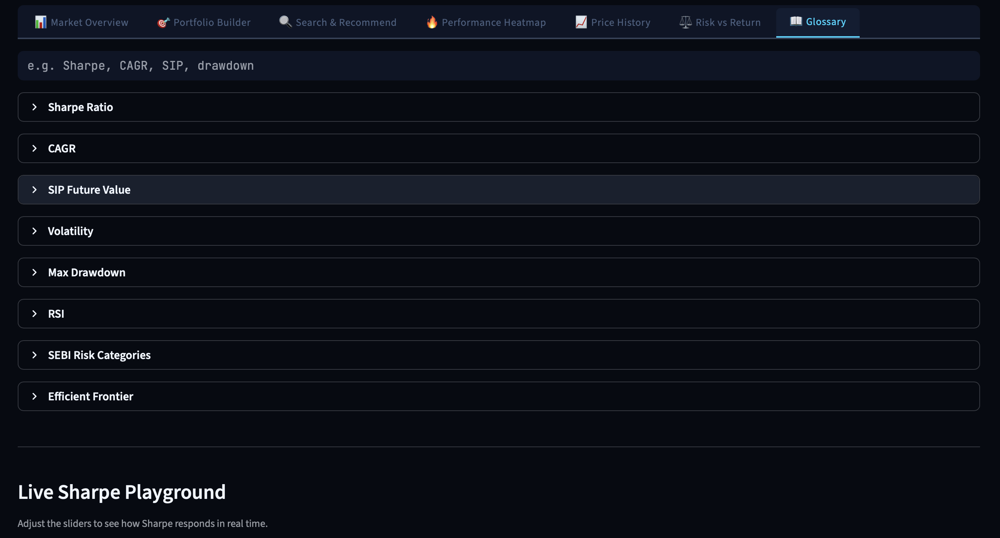

# Artha Terminal 🇮🇳📊

**A full-stack financial intelligence dashboard for Indian and US markets** — built with Python, Streamlit, and real-time market data APIs.


---

## What it does

Artha Terminal tracks **220 assets** across Indian (Nifty 100 + NSE ETFs) and US markets, providing a 20-year historical view with institutional-grade analytics:

| Feature | Details |
|---------|---------|
| **Market Overview** | Live price table with 1D/1W/1M/1Y/3Y returns, Sharpe rating, volatility, market cap |
| **Portfolio Builder** | Percentile-rank stock recommender · What-If projector with ±1σ confidence cone · Goal reverse-calculator |
| **Search & Intel** | Per-ticker intelligence card: returns, dual volatility (long-term + 1M), Sharpe, RSI, 52W stats + AI 3-statement analysis |
| **Performance Heatmap** | Treemap, sector sunburst, calendar heatmap · Top 5 gainers/decliners |
| **Price History** | Interactive chart with SMA/EMA/Bollinger overlays + RSI/MACD sub-charts |
| **Risk vs Return** | Scatter plot with Security Market Line + drawdown panel |
| **Glossary** | Searchable financial terms with live Sharpe playground |

---

## Screenshots

<table>
  <tr>
    <td><br/><sub><b>Home Page — Live Market Pulse</b></sub></td>
    <td><br/><sub><b>Home Page — Trending Assets</b></sub></td>
  </tr>
  <tr>
    <td><br/><sub><b>Market Overview — Nifty 100 Tickers</b></sub></td>
    <td><br/><sub><b>Performance Heatmap — Treemap + Sector View</b></sub></td>
  </tr>
  <tr>
    <td><br/><sub><b>Portfolio Builder — Stock Recommender</b></sub></td>
    <td><br/><sub><b>Portfolio Builder — SIP Projector</b></sub></td>
  </tr>
  <tr>
    <td><br/><sub><b>Search & Recommend — Ticker Intel Card</b></sub></td>
    <td><br/><sub><b>Stock Analysis — Technical Indicators</b></sub></td>
  </tr>
  <tr>
    <td><br/><sub><b>AI Analysis — 3-Statement Connections</b></sub></td>
    <td><br/><sub><b>AI Analysis — Financial Health Summary</b></sub></td>
  </tr>
  <tr>
    <td><br/><sub><b>Price History — SMA/EMA/Bollinger Charts</b></sub></td>
    <td><br/><sub><b>Risk vs Return — Scatter + SML</b></sub></td>
  </tr>
  <tr>
    <td><br/><sub><b>Portfolio Builder — Efficient Frontier</b></sub></td>
    <td><br/><sub><b>Glossary — Searchable Terms + Sharpe Playground</b></sub></td>
  </tr>
</table>

---

## Financial math highlights

- **Sharpe ratio** — numerator is `mean(weekly_returns) × 52`, not point-in-time 1Y return. More statistically robust for trending assets.
- **Risk-free rate** — fetched live from India's 10Y G-Sec yield (`^INBMK`), 6.5% fallback if unavailable.
- **Dual volatility** — `weekly × √52` for long-term horizon; `daily × √252` for 1-month holding period.
- **Portfolio variance** — uses full covariance matrix (`w @ Σ @ w`), not the zero-correlation approximation.
- **Efficient Frontier** — 2,000-simulation Monte Carlo with annualised covariance.
- **Returns** — calendar-accurate `pd.DateOffset` matching with 30-day tolerance, not hardcoded day counts.

---

## Run locally

### Prerequisites
- **Python 3.12+** (exact version required due to pinned dependencies)
- **pip** (Python package manager)
- Internet connection (for live market data)

### Installation steps

```bash
# 1. Clone the repository
git clone https://github.com/eshan2018/Artha-Terminal.git
cd Artha-Terminal

# 2. Create a virtual environment (recommended)
python3.12 -m venv venv
source venv/bin/activate  # On Windows: venv\Scripts\activate

# 3. Install dependencies
pip install -r requirements.txt

# 4. Set up API keys
cp .streamlit/secrets.toml.example .streamlit/secrets.toml
# Edit secrets.toml with your actual API keys (see below)

# 5. Launch the app
streamlit run home.py
```

The app will open at `http://localhost:8501` in your browser.

---

## Getting API Keys

Two free APIs are required:

### 1. Groq API (for AI financial analysis)
1. Visit https://console.groq.com/keys
2. Sign up or log in with your Groq account
3. Click **"Create API Key"**
4. Copy the key (starts with `gsk_`)
5. Paste into `.streamlit/secrets.toml` as `GROQ_API_KEY`

### 2. Alpha Vantage API (US stock data fallback)
1. Visit https://www.alphavantage.co/api/
2. Fill in the form to get a free API key
3. You'll receive the key via email
4. Paste into `.streamlit/secrets.toml` as `ALPHA_VANTAGE_API_KEY`

Both free tiers are sufficient for single-user development.

---

## Troubleshooting

| Issue | Solution |
|-------|----------|
| `ModuleNotFoundError: No module named 'yfinance'` | Ensure you're using Python 3.12: `python3.12 --version`. Reinstall deps: `pip install -r requirements.txt` |
| `streamlit: command not found` | Activate your virtual environment: `source venv/bin/activate` (macOS/Linux) or `venv\Scripts\activate` (Windows) |
| `GROQ_API_KEY not found` | Verify `.streamlit/secrets.toml` exists with your API key. Restart Streamlit: `streamlit run home.py` |
| App runs but shows no data | Check your internet connection. API rate limits? Wait 1 minute and refresh. |
| `Port 8501 already in use` | Use a different port: `streamlit run home.py --server.port 8502` |
| Charts show "No data available" | This is normal if APIs are rate-limited or offline. Data auto-refreshes on next request (300s cache). |

---

## Project structure

```
artha-terminal/
├── home.py                    # Landing page with live market pulse
├── pages/
│   ├── 1_india_market.py      # India dashboard (Nifty 100 + ETFs)
│   └── 2_us_market.py         # US dashboard (S&P 500 + ETFs)
├── shared/
│   ├── dashboard.py           # Orchestrator: data loading + tab dispatch
│   ├── calculations.py        # All financial math (Sharpe, vol, returns, SIP, MPT)
│   ├── data_loader.py         # Cached data fetching (yfinance, NSE, Alpha Vantage)
│   ├── ai_analysis.py         # Groq/Llama 3.3 70B financial statement analysis
│   ├── theme.py               # Design system + CSS tokens
│   └── tabs/                  # One file per dashboard tab
│       ├── tab_overview.py
│       ├── tab_builder.py
│       ├── tab_search.py
│       ├── tab_heatmap.py
│       ├── tab_charts.py
│       ├── tab_risk.py
│       └── tab_glossary.py
└── tickers/
    ├── india_universe.json    # 110 Indian assets (editable without touching code)
    └── us_universe.json       # 110 US assets
```

---

## Data sources

| Source | Used for |
|--------|---------|
| **yfinance** | All equities, indices, ETFs (India + US), USD/INR FX, India 10Y G-Sec yield |
| **Alpha Vantage** | US equities fallback |
| **Groq (Llama 3.3 70B)** | AI financial statement analysis (AI-generated — verify independently) |

---

## Configuration

After copying `.streamlit/secrets.toml.example` to `.streamlit/secrets.toml`, edit it with your API keys:

```toml
# .streamlit/secrets.toml (DO NOT commit this file — it's in .gitignore)

GROQ_API_KEY = "gsk_your_actual_key_here"           # Get from console.groq.com
ALPHA_VANTAGE_API_KEY = "your_actual_key_here"      # Get from alphavantage.co
```

**Important:** Never share your API keys or commit `.streamlit/secrets.toml` to GitHub. The example file is safe to commit; the secrets file is protected by `.gitignore`.

---

## Usage

Once the app launches (`http://localhost:8501`):

1. **Home Page** — View live market pulse across Indian and US indices
2. **India Market** — Explore Nifty 100 with portfolio builder, risk analysis, and AI insights
3. **US Market** — S&P 500 analysis with the same suite of tools

### Key features to try:
- **Portfolio Builder** — Create a weighted portfolio and see projected returns with confidence intervals
- **Search Intel** — Type any ticker and get AI-powered 3-statement financial analysis
- **Risk vs Return** — Visualize efficient frontier and Security Market Line
- **Glossary** — Learn financial terms with interactive Sharpe ratio calculator

---

## Disclaimer

> Artha Terminal is an educational tool. All signals are quantitative and do not constitute investment advice. Past performance does not guarantee future results. Consult a SEBI-registered investment advisor before making financial decisions.

---

## License

MIT © 2026 Eshan Mandloi
