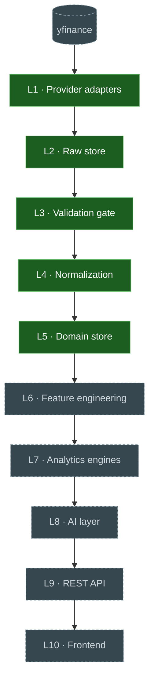

# Implementation · 03 · Walking Skeleton — Current State

| | |
|---|---|
| **Status** | Living — regenerate rather than hand-edit |
| **Source of truth** | [`tools/skeleton_status.py`](../../tools/skeleton_status.py) — probes the code and runs the real pipeline |
| **Regenerate** | `make skeleton` (board + live trace) · `python -m tools.skeleton_status --mermaid` (diagram below) |

> This page is a snapshot. The **live** view is the CLI, which determines layer status by
> importing the code and demonstrates the flow by *actually running it*. If the two ever
> disagree, the CLI is right and this page is stale — regenerate it.

## 1 · Which layers are implemented



| Layer | Status | Implementation | Owning doc |
|-------|--------|----------------|-----------|
| L1 Provider adapters | ✅ built | `PriceHistoryPort` + `YFinanceAdapter` | 06 |
| L2 Raw store | ✅ built | `RawStore` port + `FilesystemObjectStore` | 05 / 07 |
| L3 Validation gate | ✅ built | `validate_price_history` (fail-closed) | 05 |
| L4 Normalization | ✅ built | `normalize_price_history` → `PriceObservation` | 04 / 05 |
| L5 Domain store | ✅ built | `MarketDataRepository` + SQLite backend | 04 / 07 |
| L6 Feature engineering | ⬜ pending | — | 08 |
| L7 Analytics engines | ⬜ pending | — | 08 |
| L8 AI layer | ⬜ pending | *(deferred to Phase 7)* | 09 |
| L9 REST API | ⬜ pending | — | 10 |
| L10 Frontend | ⬜ pending | existing Next.js app, not yet wired to an API | 10 |

## 2 · How data flows today

```
InstrumentId("reliance")                        ← internal identity, never a vendor ticker
  │
  ├─ L1  YFinanceAdapter.fetch(request)          symbology → "RELIANCE.NS"; raw contract checked
  │        └── vendor drift ⇒ MalformedPayload   (fail closed, not a silent mis-parse)
  │
  ├─ L2  capture_price_history(response, store)  verbatim envelope → immutable object
  │        key: raw/v1/{provider}/{dataset}/{window}/{instrument}/{payload_sha256}.json
  │        └── content-addressed ⇒ re-capture is idempotent; re-writing a key raises
  │
  ├─ L3  validate_price_history(response, ref)   schema · ranges · OHLC consistency · duplicates
  │        ├── hard failure ⇒ quarantined with reasons (never reaches canonical)
  │        └── soft failure ⇒ quality flag travels with the data
  │
  ├─ L4  normalize_price_history(...)            → PriceObservation
  │        ├── Money(Decimal, Currency) for equities · IndexLevel(Decimal) for indices
  │        ├── native currency preserved (no FX: FXRate is a later data class)
  │        ├── knowledge_time populated on every row (C1)
  │        └── provenance pins raw object key + provider/contract/reference versions
  │
  └─ L5  repository.save_observations(...)       idempotent; effective-dated by knowledge_time
           └── corrections insert a new version; nothing is overwritten
```

Everything above L5 (features → analytics → API → frontend) is **not yet connected**; the
existing Next.js site still reads its snapshot JSON, exactly as the strangler plan intends.

## 3 · Milestones

| | Milestone | State |
|---|-----------|-------|
| M0 | Engineering decisions recorded | ✅ complete |
| M1 | Guardrails + layer skeleton | ✅ complete |
| M2 | Provider slice (L1) | ✅ complete |
| M2b | Raw store (L2) | ✅ complete |
| M2c | Gate + normalization (L3–L4) | ✅ complete |
| M2d | Domain store (L5) | ✅ complete |
| M3 | Compute slice — feature + engine (L6–L7) | ⬜ remaining |
| M4 | Serve slice — API + frontend (L9–L10) | ⬜ remaining |
| M5 | DAG + recompute-from-raw timing | ⬜ remaining |

## 4 · A real example, end to end

Run `make skeleton` for the live version. Abridged output for **RELIANCE**, where the sample
deliberately includes one invalid bar so the gate's behaviour is visible:

```
L1  Provider adapter
      internal id       reliance
      vendor symbol     RELIANCE.NS  (resolved by symbology)
      raw contract      yfinance-ohlcv/v1
      bars fetched      3

L2  Raw store (immutable)
      object key        raw/v1/yfinance/price-history/…/reliance/23fcf03b….json
      immutability      re-writing this key raises ObjectAlreadyExists

L3  Validation gate (fail-closed)
      accepted          2
      quarantined       1
        rejected        2025-07-03T00:00:00 — close must be > 0, got -1.0

L4  Normalization → canonical
      observations      2
      close (exact)     1436.25 INR   [Money]
      knowledge_time    2026-07-18T11:51:47+00:00   (C1: always populated)
      authority         AUTHORITATIVE

L5  Domain store (repository)
      rows written      2
      re-running writes 0   (idempotent — effective-dated by knowledge_time)
      quarantine kept   1   (rejected data is retained, not lost)

LINEAGE — a stored fact traced back to its source
  Money 2025-07-01
    ← raw object   raw/v1/yfinance/price-history/…/reliance/23fcf03b….json
    ← provider     yfinance (yfinance-ohlcv/v1)
    ← verbatim     3 bars captured at 2026-07-18T11:51:47+00:00
```

Try `--instrument nifty-50` to see an index normalize to **unitless points with no currency**,
making FX conversion type-impossible.

## Change log
| Date | Change |
|------|--------|
| 2026-07-17 | Created after M2d. Layers L1–L5 built; L6–L10 pending. |
