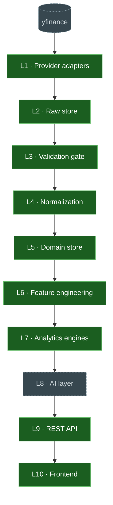

# Implementation · 03 · Walking Skeleton — Current State

| | |
|---|---|
| **Status** | Living — regenerate rather than hand-edit |
| **Source of truth** | [`tools/skeleton_status.py`](../../tools/skeleton_status.py) — probes the code and runs the real pipeline |
| **Regenerate** | `make skeleton` (board + live trace) · `python -m tools.skeleton_status --mermaid` (diagram below) |

> This page is a snapshot. The **live** view is the CLI, which determines layer status by
> importing the code and demonstrates the flow by *actually running it*. If the two ever
> disagree, the CLI is right and this page is stale — regenerate it.

## 1 · Which layers are implemented



| Layer | Status | Implementation | Owning doc |
|-------|--------|----------------|-----------|
| L1 Provider adapters | ✅ built | `PriceHistoryPort` + `YFinanceAdapter` | 06 |
| L2 Raw store | ✅ built | `RawStore` port + `FilesystemObjectStore` | 05 / 07 |
| L3 Validation gate | ✅ built | `validate_price_history` (fail-closed) | 05 |
| L4 Normalization | ✅ built | `normalize_price_history` → `PriceObservation` | 04 / 05 |
| L5 Domain store | ✅ built | `MarketDataRepository` + SQLite backend | 04 / 07 |
| L6 Feature engineering | ✅ built | `build_close_price_series` → `ClosePriceSeries` (the C3 seam) | 08 |
| L7 Analytics engines | ✅ built | `one_year_return` → `AnalyticResult` | 08 |
| L8 AI layer | ⬜ pending | *(deferred to Phase 7)* | 09 |
| L9 REST API | ✅ built | `create_app` + one endpoint + committed `openapi.json` | 10 |
| L10 Frontend | ✅ built | live-API pane beside the snapshot JSON, via a same-origin proxy | 10 |

## 2 · How data flows today

```
InstrumentId("reliance")                        ← internal identity, never a vendor ticker
  │
  ├─ L1  YFinanceAdapter.fetch(request)          symbology → "RELIANCE.NS"; raw contract checked
  │        └── vendor drift ⇒ MalformedPayload   (fail closed, not a silent mis-parse)
  │
  ├─ L2  capture_price_history(response, store)  verbatim envelope → immutable object
  │        key: raw/v1/{provider}/{dataset}/{window}/{instrument}/{payload_sha256}.json
  │        └── content-addressed ⇒ re-capture is idempotent; re-writing a key raises
  │
  ├─ L3  validate_price_history(response, ref)   schema · ranges · OHLC consistency · duplicates
  │        ├── hard failure ⇒ quarantined with reasons (never reaches canonical)
  │        └── soft failure ⇒ quality flag travels with the data
  │
  ├─ L4  normalize_price_history(...)            → PriceObservation
  │        ├── Money(Decimal, Currency) for equities · IndexLevel(Decimal) for indices
  │        ├── native currency preserved (no FX: FXRate is a later data class)
  │        ├── knowledge_time populated on every row (C1)
  │        └── provenance pins raw object key + provider/contract/reference versions
  │
  ├─ L5  repository.save_observations(...)       idempotent; effective-dated by knowledge_time
  │        └── corrections insert a new version; nothing is overwritten
  │
  ├─ L6  build_close_price_series(repo, id,      → ClosePriceSeries  [close-price-series/v1]
  │                               as_of=…)
  │        ├── THE C3 SEAM: the one decimal→float conversion, one-way (no inverse)
  │        ├── as-of filter on BOTH event_time and knowledge_time ⇒ lookahead-free
  │        └── carries a FeatureRef naming every observation consumed
  │
  └─ L7  one_year_return(series,                 → AnalyticResult    [one-year-total-return/v1]
                         computed_at=…)
           ├── pure: no I/O, no clock, no randomness; features only, never repositories
           ├── (P_end / P_start) − 1 as a unitless Ratio; anchor within ±7 days of −365d
           └── missing/undefined input ⇒ Unavailable(reason), never zero
```

  → L9  GET /v1/instruments/{id}/metrics/one-year-return  DTO + lineage + freshness
  → L10 the terminal renders it in pane [09], beside the snapshot panes

Both data paths now run on the same page — that is the strangler (ADR-0020). The snapshot panes
are untouched and keep working when the backend is down; the live pane degrades to an explicit
"api offline" message rather than blanking or showing a zero.

## 3 · Milestones

| | Milestone | State |
|---|-----------|-------|
| M0 | Engineering decisions recorded | ✅ complete |
| M1 | Guardrails + layer skeleton | ✅ complete |
| M2 | Provider slice (L1) | ✅ complete |
| M2b | Raw store (L2) | ✅ complete |
| M2c | Gate + normalization (L3–L4) | ✅ complete |
| M2d | Domain store (L5) | ✅ complete |
| M3 | Compute slice — feature + engine (L6–L7) | ✅ complete |
| M4 | Serve slice — API + frontend (L9–L10) | ✅ complete |
| M5 | DAG + recompute-from-raw timing | ✅ complete — RTO ~0.011 s, byte-identical |

## 4 · A real example, end to end

Run `make skeleton` for the live version. Abridged output for **RELIANCE**, where the sample
deliberately includes one invalid bar so the gate's behaviour is visible — and spans days rather
than a year, so L7 demonstrates the guarantee that matters most: **absence with a reason, never a
fabricated zero**:

```
L1  Provider adapter
      internal id       reliance
      vendor symbol     RELIANCE.NS  (resolved by symbology)
      raw contract      yfinance-ohlcv/v1
      bars fetched      3

L2  Raw store (immutable)
      object key        raw/v1/yfinance/price-history/…/reliance/23fcf03b….json
      immutability      re-writing this key raises ObjectAlreadyExists

L3  Validation gate (fail-closed)
      accepted          2
      quarantined       1
        rejected        2025-07-03T00:00:00 — close must be > 0, got -1.0

L4  Normalization → canonical
      observations      2
      close (exact)     1436.25 INR   [Money]
      knowledge_time    2026-07-18T11:51:47+00:00   (C1: always populated)
      authority         AUTHORITATIVE

L5  Domain store (repository)
      rows written      2
      re-running writes 0   (idempotent — effective-dated by knowledge_time)
      quarantine kept   1   (rejected data is retained, not lost)

L6  Feature engineering (the C3 seam)
      feature           close-price-series/v1
      points            2  (as-of …, filtered on event_time AND knowledge_time)
      decimal → float   1410.5 → 1410.5   (one-way; no inverse exists)
      parameters pinned {'interval': '1d'}

L7  Analytics engine → AnalyticResult
      metric            one_year_return
      formula           one-year-total-return/v1
      UNAVAILABLE       insufficient-history-for-a-one-year-window   (never zero — principle 13)
      lineage           2 observation(s) → 1 raw object(s)

LINEAGE — a stored fact traced back to its source
  Money 2025-07-01
    ← raw object   raw/v1/yfinance/price-history/…/reliance/23fcf03b….json
    ← provider     yfinance (yfinance-ohlcv/v1)
    ← verbatim     3 bars captured at 2026-07-18T11:51:47+00:00
```

Try `--instrument nifty-50` to see an index normalize to **unitless points with no currency**,
making FX conversion type-impossible.

## Change log
| Date | Change |
|------|--------|
| 2026-07-17 | Created after M2d. Layers L1–L5 built; L6–L10 pending. |
| 2026-07-22 | Regenerated after M5. **Phase 0.5 (Walking Skeleton) complete** — all nine of its milestones; Definition of Done met in full. Phases 1–8 of doc 15 remain. The ingest DAG runs forward-only on a stdlib task graph (ED-015) and the recompute-from-raw procedure reproduces the served metric byte-identically in ~0.011 s (local baseline — see [04-recompute-rto.md](04-recompute-rto.md)). |
| 2026-07-22 | Regenerated after M4. L9 (endpoint + OpenAPI artifact) and L10 (live pane + composition root) built; only L8 (Phase 7) and M5 remain. |
| 2026-07-18 | Regenerated after M3. L6 (close-price-series feature, the C3 seam) and L7 (`one_year_return` → `AnalyticResult`) built; L8–L10 pending. |
